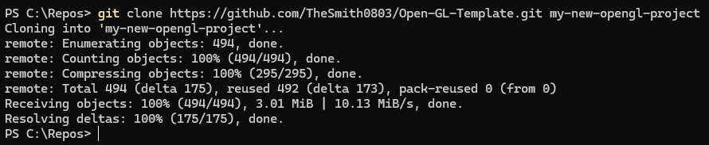
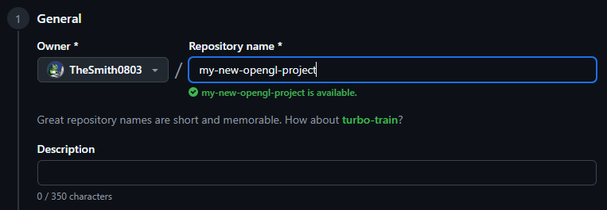
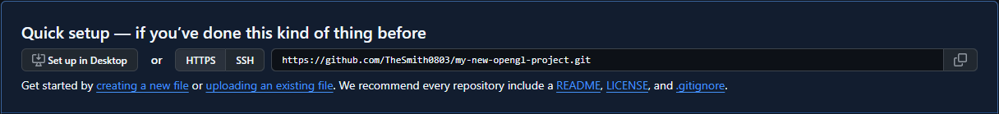
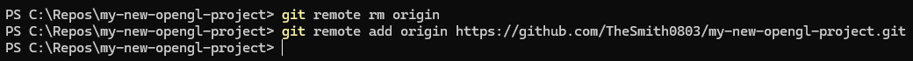
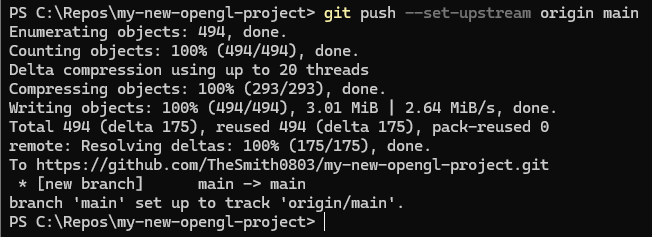

# Instructions for making a new OpenGL project

First, you must clone this repo and add your new project title as the last argument
(this will rename the parent folder).

Then you can go create a new repo on github.

SIDENOTE: You do not need to name the remote repo the same as the local repo.

Copy the http of the repo to the clipboard.

Then you must remove the current remote from the current rep, and then add the new one

Then (if you want to be able to just call "git push" instead of "git push origin main"), you must set main as the current upstream branch

# Should be all good now!

You should be able to now treat this repo like any other repo, enjoy your OpenGL template!

